# Frontend Boilerplate (Lab 7, 8–9)
Конструювання програмного забезпечення (КПЗ)  

**Студентка:** Матвєєнко Олександра  
**Група:** ІПЗ-3.03  

---

## 🎓 Kindergarten App — CRUD + Auth

Навчальний full‑stack застосунок для керування **групами** та **дітьми** у дитячому садку з підтримкою **авторизації через JWT**.

---

## 🛠️ Стек технологій

### Frontend

- Vite
- React + TypeScript
- TanStack Router
- TanStack Query
- Zustand (збереження JWT)
- Axios (HTTP‑клієнт з інтерцепторами)
- Zod + React Hook Form (валідація форм)
- Tailwind CSS

### Backend

- Express.js
- TypeORM
- PostgreSQL
- JWT Auth
- Validation Middleware
- DTO
- Layered Architecture (Controller → Service → Repository)

> **Інтерцептор** — механізм, що дозволяє перехоплювати HTTP‑запити/відповіді до або після їх обробки (логування, авторизація тощо), не змінюючи бізнес‑логіку.

---

## 🔗 Запуск проєкту

Для роботи застосунку потрібні **обидві частини**: бекенд і фронтенд.

### 🧩 Backend

1. Клонуйте репозиторій:  
    [KPZ_Labs_Matvieienko_BackendBoilerplate](https://github.com/Allaandra/KPZ_Labs_Matvieienko_BackendBoilerplate)
2. Встановіть залежності та запустіть сервер:

    ```bash
    npm install
    npm run dev
    ```

3. Переконайтеся, що бекенд працює на очікуваному порту  
    (за замовчуванням `http://localhost:4000`).  
    Деталі налаштування див. у `README` бекенд‑проєкту.

### 🖥️ Frontend

1. Встановіть залежності та запустіть фронтенд у режимі розробки:

    ```bash
    pnpm install
    pnpm dev
    ```

2. За замовчуванням застосунок доступний за адресою:  
    [http://localhost:5173](http://localhost:5173)

3. Переконайтеся, що у фронтенді коректно налаштована адреса бекенда  
    (через `.env` або файл конфігурації, URL має вказувати на працюючий сервер бекенда).

---

## 📌 Функціонал

- 🔐 **Авторизація через JWT**
  - Логін через `POST /auth/login`
  - Токен зберігається у Zustand та `localStorage`
  - Axios автоматично додає токен у заголовок `Authorization`
  - На помилку `401` — автоматичний вихід та редірект на `/login`

- 👥 **Групи**
  - Перегляд списку груп
  - Створення / редагування / видалення
  - Заборона видалення, якщо в групі є діти
  - Сортування за:
     - ID
     - назвою групи

- 👶 **Діти**
  - Перегляд списку дітей
  - Створення / редагування / видалення
  - Вибір групи при створенні / редагуванні
  - Сортування за:
     - ID
     - прізвищем
     - датою народження
     - групою

- 🎨 **UI**
  - Оформлення у стилі *baby pink / baby blue* на базі Tailwind CSS

- 📡 **Робота з API**
  - TanStack Query для запитів, кешування й інвалідації
  - Axios з інтерцепторами та автоматичною підстановкою токена

- 🚫 **Захист сторінок**
  - Закриті маршрути для неавторизованих користувачів

---

## 🧭 Маршрути

### Auth

- `/login` — сторінка авторизації
- `/` — головна сторінка

### Groups

- `/groups` — список груп
- `/groups/new` — створення групи
- `/groups/$groupId` — редагування групи  
- Видалення групи — через відповідну дію (кнопка)

### Children

- `/children` — список дітей
- `/children/new` — створення дитини
- `/children/$childId` — редагування дитини  
- Видалення дитини — через відповідну дію (кнопка)

---

## 🧠 Ключові фрагменти коду

### 📡 Axios: конфігурація та інтерцептори

```typescript
import axios from "axios";
import { useAuthStore } from "../store/auth";

const apiClient = axios.create({
  baseURL: import.meta.env.VITE_API_BASE_URL,
  headers: { "Content-Type": "application/json" },
});

// === REQUEST INTERCEPTOR ===
apiClient.interceptors.request.use((config) => {
  const token = useAuthStore.getState().token;
  if (token) config.headers.Authorization = `Bearer ${token}`;
  return config;
});

// === RESPONSE INTERCEPTOR ===
apiClient.interceptors.response.use(
  (res) => res,
  (error) => {
     if (error.response?.status === 401) {
        useAuthStore.getState().clearToken();
        window.location.href = "/login";
     }
     return Promise.reject(error);
  }
);

export default apiClient;
```

### 🧵 Hook для TanStack Query (отримання груп)

```typescript
export const useGroups = () =>
  useQuery({
     queryKey: ["groups"],
     queryFn: getGroups,
  });
```

### 🧩 Zod‑схема (створення дитини)

```typescript
const childCreateSchema = z.object({
  firstName: z.string().min(2, "Імʼя занадто коротке"),
  lastName: z.string().min(2, "Прізвище занадто коротке"),
  patronymic: z.string().min(2, "По батькові занадто коротке"),
  birthdayDate: z.string().min(1, "Оберіть дату"),
  groupId: z.coerce.number().min(1, "Оберіть групу"),
});
```

---

## 🖼️ Скріншоти

### Авторизація

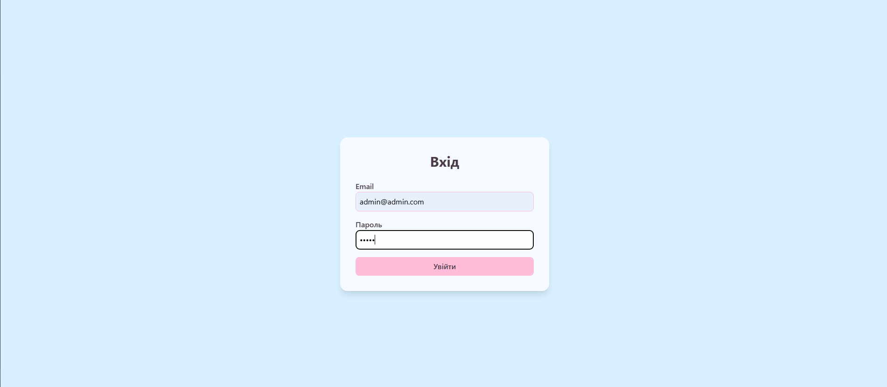

### Головна сторінка

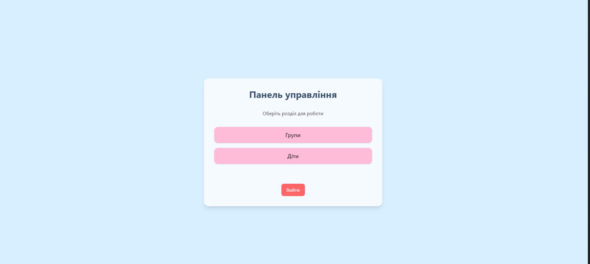

### Групи

Список груп:  
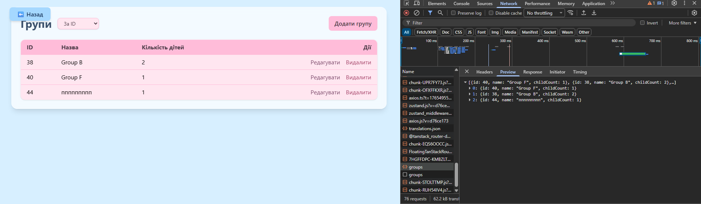  

Створення групи:  
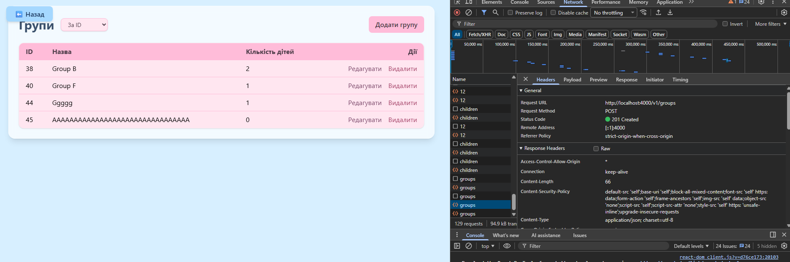  

Редагування групи:  
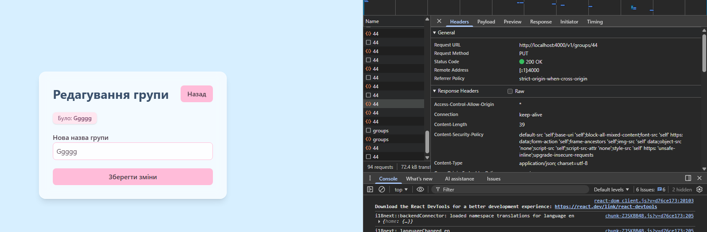  

Видалення групи:  
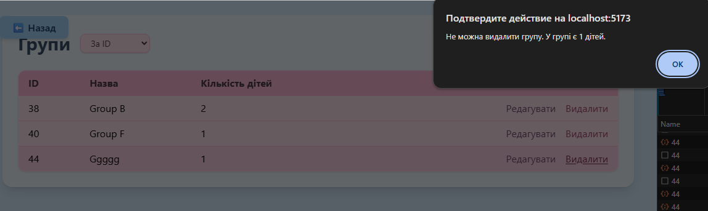  
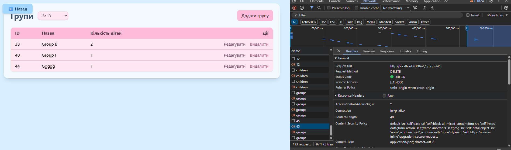  

> Поки в групі є хоча б одна дитина, групу неможливо видалити.

### Діти

Список дітей:  
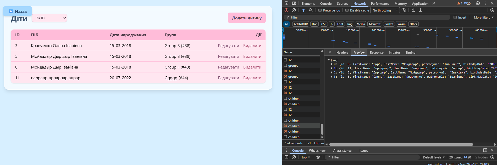  

Створення дитини:  
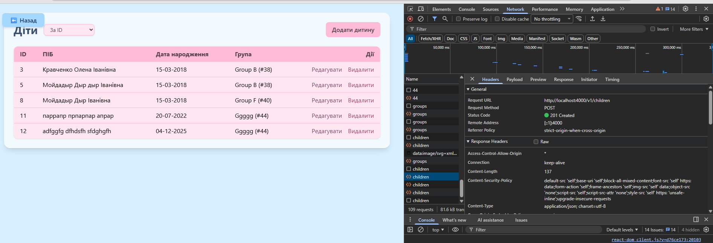  

Редагування дитини:  
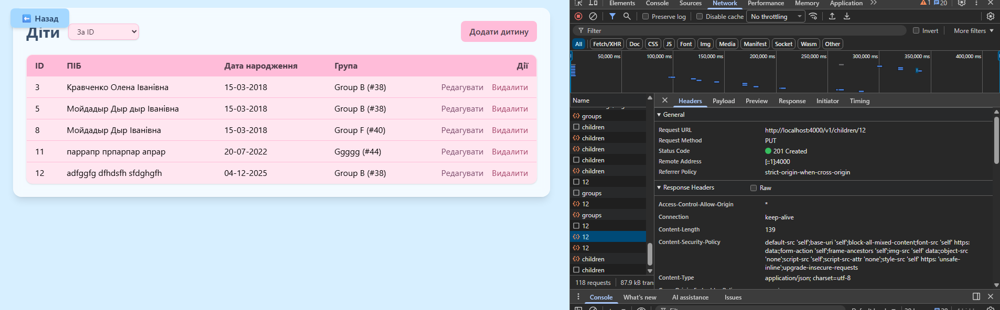  

Видалення дитини:  
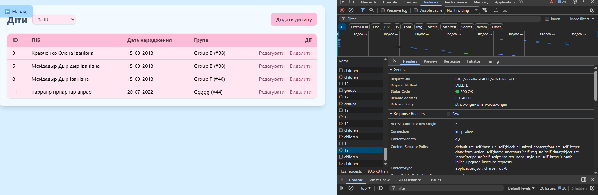

---

## ✅ Висновок

У межах лабораторно‑практичної роботи №8–9 було реалізовано сучасний клієнтський застосунок, що інтегрується з REST API та демонструє:

- використання Vite + React + TypeScript для структурованого й типізованого фронтенда;
- типобезпечну маршрутизацію (TanStack Router);
- роботу з серверним станом і кешем (TanStack Query);
- декларативну валідацію форм (React Hook Form + Zod);
- авторизацію на основі JWT із зберіганням стану в Zustand;
- повний CRUD для сутностей «групи» та «діти» з перевіркою бізнес‑логіки;
- реалізацію захищених маршрутів і обробку помилок авторизації.

Отриманий проєкт є прикладом практичного застосування актуальних інструментів фронтенд‑розробки та може слугувати базою для подальшого розширення функціоналу.